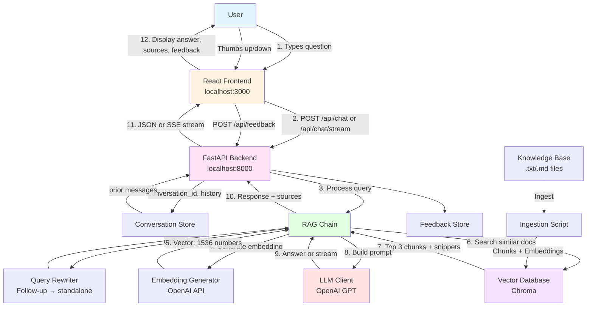
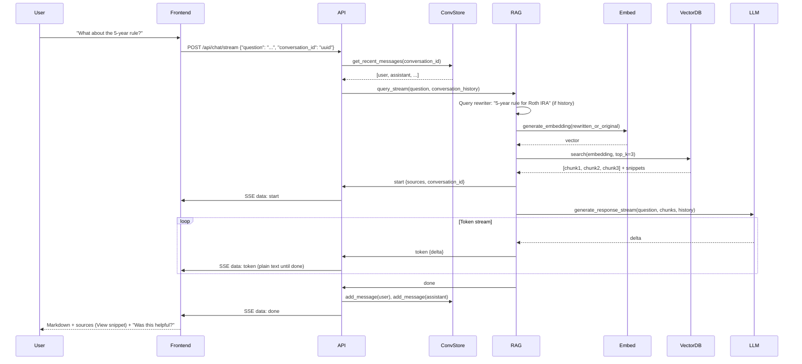

# Architecture Diagram

## System Architecture



## Data Flow: Single Query (with conversation & streaming)



## Component Responsibilities

```mermaid
graph LR
    subgraph Frontend["Frontend Layer"]
        UI[ChatInterface.jsx<br/>- Messages, streaming (plain → Markdown when done)<br/>- Sources + View snippet<br/>- Was this helpful? 👍👎<br/>- New conversation]
    end
    
    subgraph API["API Layer"]
        Main[main.py<br/>- /api/chat, /api/chat/stream, /api/feedback<br/>- Input validation, timeouts]
    end
    
    subgraph RAG["RAG Layer"]
        Chain[rag_chain.py<br/>- query + query_stream<br/>- Orchestrate pipeline]
        Rewriter[query_rewriter.py<br/>- Follow-up → standalone query]
        Embed[embeddings.py<br/>- Text → Vectors]
        Vector[vector_store.py<br/>- Store & search]
        LLM[llm_client.py<br/>- generate_response + generate_response_stream]
    end
    
    subgraph Stores["Stores"]
        Conv[conversation_store.py<br/>- Per-conversation message history]
        FB[feedback_store.py<br/>- Thumbs up/down per turn]
    end
    
    subgraph Data["Data Layer"]
        KB[knowledge_base/<br/>.txt/.md files]
        DB[(Chroma DB<br/>Vector storage)]
    end
    
    UI -->|HTTP/SSE| Main
    Main --> Conv
    Main --> Chain
    Main --> FB
    Chain --> Rewriter
    Chain --> Embed
    Chain --> Vector
    Chain --> LLM
    Vector --> DB
    KB -->|Ingestion| DB
    
    style Frontend fill:#e1f5ff
    style API fill:#fff4e1
    style RAG fill:#e1ffe1
    style Data fill:#f5e1ff
```

## File Structure & Dependencies

```
Agent/
├── backend/
│   ├── main.py ──────────────┐
│   │   └─> FastAPI app, /api/chat, /api/chat/stream, /api/feedback
│   ├── rag_chain.py ─────────┤
│   ├── query_rewriter.py ────┤  Follow-up → standalone query
│   ├── embeddings.py ────────┤
│   ├── vector_store.py ──────┤
│   ├── llm_client.py ────────┤  Sync + stream generation
│   ├── conversation_store.py ┼─> In-memory conversation history
│   ├── feedback_store.py ────┤  In-memory thumbs up/down
│   └── config.py ────────────┘  + MAX_QUESTION_LENGTH, timeouts
│
├── frontend/src/
│   ├── App.jsx
│   └── components/
│       ├── ChatInterface.jsx   Streaming, sources+snippets, feedback
│       └── FeedbackModal.jsx   Feature request modal + optional screenshot
│
├── scripts/
│   └── ingest_documents.py
│
└── knowledge_base/
    └── *.txt, *.md
```

## Technology Stack

| Component | Technology | Purpose |
|-----------|-----------|---------|
| **Backend Framework** | FastAPI | REST API, async support, auto docs |
| **Vector Database** | Chroma | Local vector storage & search |
| **Embeddings** | OpenAI `text-embedding-3-small` | Text → 1536-dim vectors |
| **LLM** | OpenAI `gpt-4o-mini` | Generate responses |
| **Frontend** | React + Vite | Modern UI framework |
| **Language** | Python 3.9+ | Backend logic |

## Key Design Patterns

### 1. Separation of Concerns
- Each module has a single responsibility
- Easy to test and modify independently

### 2. Dependency Injection
- Components initialized in `rag_chain.py`
- Can swap implementations easily

### 3. Configuration Management
- Centralized in `config.py`
- Environment variable support
- **Slack — general feedback modal**
  - **Text only** (POST `/api/feedback/general` with `message`): uses `SLACK_WEBHOOK_URL` or `SLACK_WEBHOOK` if set; **otherwise** falls back to `SLACK_BOT_TOKEN` + `SLACK_FEEDBACK_CHANNEL_ID` via `chat.postMessage` (so bot-only setups still receive feedback text).
  - **With screenshot** (`multipart/form-data`: `message` + `screenshot` file): requires **Slack Bot** env vars — incoming webhooks cannot attach files. Uploads use **`files.getUploadURLExternal` + `files.completeUploadExternal`** (modern apps no longer support legacy `files.upload`).
    - Env: `SLACK_BOT_TOKEN` — Bot token (`xoxb-…`).
    - Env: `SLACK_FEEDBACK_CHANNEL_ID` — Channel ID where posts should appear (e.g. `C…`). Invite the bot to that channel.
    - Slack app scopes: **`files:write`**, and **`chat:write`** if you rely on the bot for text (no webhook). Re-install the app to workspace after adding scopes.
  - If the client sends a screenshot but these vars are unset, the API returns **400** with a clear `detail` message.

### 4. Error Handling
- Graceful fallbacks ("I don't know")
- Input validation (max question length, timeouts)
- SSE error events for stream failures

### 5. Input Limits & Timeouts (config.py)
- **MAX_QUESTION_LENGTH** (default 2000): Reject longer questions with 400
- **CHAT_TIMEOUT_SECONDS** (default 90): Non-streaming /api/chat max duration
- **STREAM_CHUNK_TIMEOUT_SECONDS** (default 60): Max wait between stream events
- **STREAM_TOTAL_TIMEOUT_SECONDS** (default 120): Max duration for full stream

## Data Formats

### Chat Request (POST /api/chat or /api/chat/stream)
```json
{
  "question": "How do I reset my password?",
  "conversation_id": "uuid-or-null"
}
```

### Chat Response (JSON, /api/chat)
```json
{
  "answer": "To reset your password, go to the login page...",
  "sources": [
    {
      "source": "faq.txt",
      "relevance_score": 0.88,
      "snippet": "To reset your password, go to the login page and click Forgot Password..."
    }
  ],
  "context_used": true,
  "conversation_id": "uuid"
}
```

### Stream Events (SSE, /api/chat/stream)
- `data: {"event":"start","sources":[...],"context_used":true,"conversation_id":"uuid"}`  
  (or `"message": "I don't have enough information..."` when no context)
- `data: {"event":"token","delta":"..."}`
- `data: {"event":"done"}`
- `data: {"event":"error","message":"..."}`

### Feedback Request (POST /api/feedback)
```json
{
  "conversation_id": "uuid",
  "turn_index": 0,
  "helpful": true
}
```

### General feedback (POST /api/feedback/general)
- `Content-Type: multipart/form-data`
- Fields: `message` (string, optional if a screenshot is attached), `screenshot` (optional file, PNG).

### Vector Database Entry
```python
{
  "id": "faq.txt_2_a1b2c3d4",
  "document": "To reset your password...",
  "embedding": [0.23, -0.45, 0.67, ...],  # 1536 numbers
  "metadata": {
    "source": "faq.txt",
    "chunk_index": 2,
    "total_chunks": 5
  }
}
```
